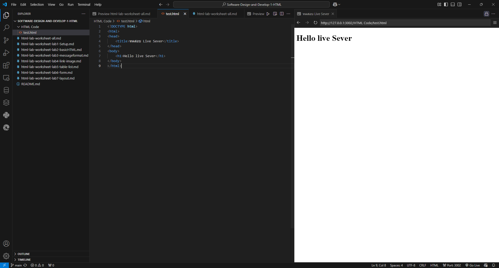

# ใบงานการทดลอง HTML

## จุดประสงค์การเรียนรู้
1. อธิบายโครงสร้างของ HTML ได้
2. สามารถใช้งาน HTML tag พื้นฐานได้
3. สามารถสร้างหน้าเว็บเพจอย่างง่ายได้

## เครื่องมือที่ใช้
1. Visual Studio Code
2. Web Browser 
3. Extension Live Server


## การทดลองที่ 1: การติดตั้งและเตรียมเครื่องมือ

### ขั้นตอนที่ 1: การติดตั้ง Visual Studio Code
1. เปิดเว็บเบราว์เซอร์และเข้าไปที่ https://code.visualstudio.com
2. คลิกปุ่ม Download โดยเลือกตามระบบปฏิบัติการ
3. เมื่อดาวน์โหลดเสร็จ ให้เปิดไฟล์ที่ดาวน์โหลดมา
4. ทำตามขั้นตอนการติดตั้ง:
    - เลือกตัวเลือกเพิ่มเติม:
     * [✓] Add "Open with Code" action to Windows Explorer file context menu
     * [✓] Add "Open with Code" action to Windows Explorer directory context menu
     * [✓] Register Code as an editor for supported file types
     * [✓] Add to PATH

### ขั้นตอนที่ 2: การติดตั้ง Extension Live Server
1. เปิดโปรแกรม Visual Studio Code
2. คลิกไอคอน Extensions ที่แถบด้านซ้าย (รูปสี่เหลี่ยมจตุรัส 4 ชิ้น) หรือกด Ctrl+Shift+X
3. พิมพ์คำว่า "Live Server" ในช่องค้นหา
4. มองหา "Live Server" ของ Ritwick Dey (มักจะอยู่อันดับแรก)
5. คลิกปุ่ม "Install"
6. รอจนติดตั้งเสร็จ (ปุ่มจะเปลี่ยนเป็น "Uninstall")
7. คลิก "Reload" เพื่อเริ่มการทำงานของ Extension

### ขั้นตอนที่ 3: การสร้างโฟลเดอร์สำหรับเก็บไฟล์งาน
1. เปิด File Explorer (Windows) หรือ Finder (macOS)
2. ไปที่ตำแหน่งที่ต้องการสร้างโฟลเดอร์
3. คลิกขวา > New > Folder
4. ตั้งชื่อโฟลเดอร์เป็น "html-workshop"
5. เปิด VS Code
6. ไปที่ File > Open Folder หรือกด Ctrl+K Ctrl+O
7. เลือกโฟลเดอร์ "html-workshop" ที่สร้างไว้
8. คลิก "Select Folder"

### ขั้นตอนที่ 4: การทดสอบ Live Server
1. สร้างไฟล์ใหม่:
   - คลิกไอคอน New File ในแถบด้านซ้าย หรือกด Ctrl+N
   - ไปที่ File > Save หรือกด Ctrl+S
   - ตั้งชื่อไฟล์เป็น "test.html"
2. พิมพ์โค้ด HTML พื้นฐาน:
   ```html
   <!DOCTYPE html>
   <html>
   <head>
       <title>ทดสอบ Live Server</title>
   </head>
   <body>
       <h1>สวัสดี Live Server</h1>
   </body>
   </html>
   ```
3. บันทึกไฟล์ (Ctrl+S)
4. เริ่มใช้งาน Live Server โดยทำวิธีใดวิธีหนึ่ง:
   - คลิกขวาที่ไฟล์ test.html แล้วเลือก "Open with Live Server"
   - คลิก "Go Live" ที่แถบสถานะด้านล่าง
   - กด Alt+L Alt+O
5. เว็บเบราว์เซอร์จะเปิดขึ้นมาโดยอัตโนมัติที่ http://127.0.0.1:5500
6. ทดสอบการทำงาน:
   - แก้ไขข้อความใน <h1>
   - บันทึกไฟล์
   - สังเกตว่าเบราว์เซอร์รีเฟรชอัตโนมัติ
   - 
#### หมายเหตุ สามารถติดตั้ง Live Preview ของไมโครซอฟต์ แทนการใช้ Live Server เมื่อติดตั้งแล้ว สามารถคลิกเมาส์ด้านขวาที่ไฟล์ HTML เลือกเมนู Show Preview เพื่อดูผลลัพธ์ HTML ได้เช่นกัน
  
### บันทึกผลการทดลอง



